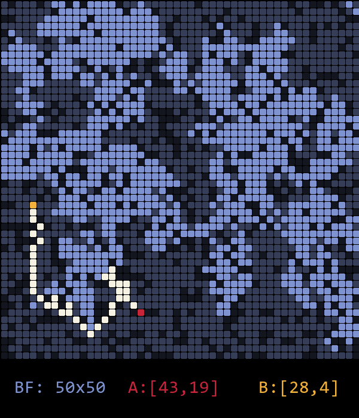
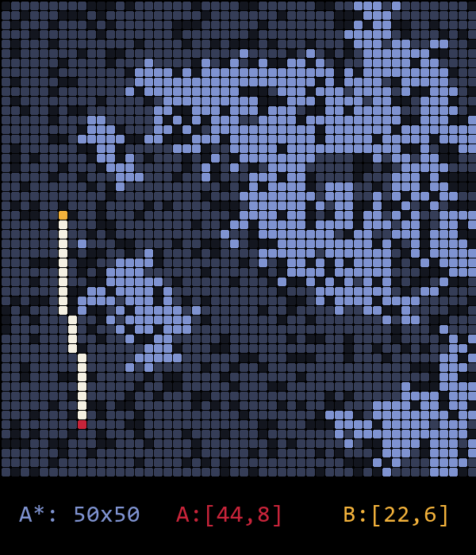

# Node-Mesh-Heuristics
## Integrantes:
- Christian Willy Aranibar Solaligue
## Version 2.0.0
### Descripción
Esta segunda versión contiene el arreglo de bugs al momento de querer ejecutar el algoritmo
**BestFirstSearch**. Además, se añade la opción de poder generar una cantidad **n** de obstáculos.
Para la parte visual se añade el archivo `map.py` que permite visualizar el mapa generado por los
algoritmos de búsqueda.
### Modo de uso
En principio se debe ejecutar el archivo `main.cpp` para poder generar el mapa. Luego, se debe
ejecutar el archivo `src\map.py` para poder visualizar el mapa generado por los algoritmos de búsqueda heurística.
Tenga en cuenta lo siguiente:
- `pBorrado`: Es el porcentaje de nodos que se van a borrar del mapa generado.
- `cObstacles`: Es la cantidad de obstáculos que se van a generar en el mapa generado.
- `rPropagation`: Es el porcentaje de nodos que se van a propagar del mapa generado.
Una vez finalizada la ejecución de `src\map.py` se guardará una imagen con el nombre del algoritmo de búsqueda usado
en la carpeta `img`.
### Imágenes generadas.
### BestFirstSearch

### A*
